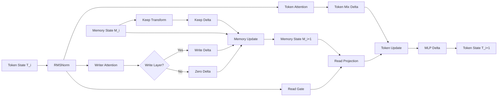

# Architecture

## Revision History
- 2026-03-04: Initial living architecture doc created from current dual-stream implementation and stress frontier status.

## System Summary
The model is a dual-stream transformer variant:
- Token stream `T` for generic sequence processing.
- Explicit memory stream `M` for write/keep/read behavior.

The key design invariant is that keep layers preserve memory exactly (no write delta), while write layers perform controlled memory updates.

## Component Map
- Model core: `src/modulus_memory_channels/model.py`
- Config and schedules: `src/modulus_memory_channels/config.py`
- Training loop and regularization usage: `src/modulus_memory_channels/training.py`
- Probe harness and metrics: `src/modulus_memory_channels/probe_runner.py`
- Report/sweep/stress scoring: `src/modulus_memory_channels/reporting.py`

## Per-Layer Block

## Write/Keep Scheduling
- Config fields:
  - `memory_write_interval`
  - `memory_write_layers`
- Write layer condition:
  - `(layer_index % memory_write_interval) == 0`
  - and `(layer_index // memory_write_interval) < memory_write_layers`
- Non-write (keep) layers:
  - `memory_delta = 0`
  - `next_memory = memory` (exact identity on memory state)

## Stability and Observability
- Corridor stability is evaluated on memory view (`state_view="memory"`):
  - keep-layer Jacobian deviation from 1
  - keep-layer state drift
  - keep-layer state delta norm
  - keep-layer leakage
- Known diagnostic caveat:
  - operator eigenspace drift can be misleading near degenerate identity operators.
  - state-based drift/delta metrics are primary in keep-layer interpretation.

## Current Proven Envelope (as of 2026-03-04)
From `demo_runs/corridor_stress_v5`:
- Up to 16 layers tested.
- Up to 6 stored memories.
- Distance up to 64 (eval to 72).
- 32 distractors, 96 pair inventory.
- Corridor stability remained strong even in failed retrieval-threshold cases.
