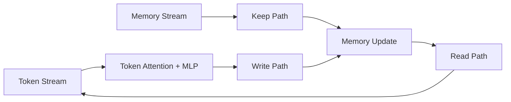
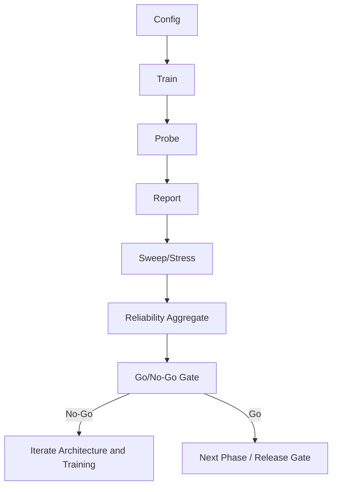

# Executive Overview

## Revision History
- 2026-03-05: Added phase-gate closure (frontier/adversarial/repro all PASS) and upgraded recommendation to RC execution for locked profile.
- 2026-03-05: Upgraded level-up signal from 3-seed preliminary to 10-seed confirmed (`60/60`).
- 2026-03-05: Added level-up campaign signal (`18/18`) with preliminary-status caveat.
- 2026-03-05: Added GPU execution validation and throughput findings.
- 2026-03-05: Expanded reliability matrix to 10 seeds (60 trials) and updated go/no-go evidence.
- 2026-03-04: Initial executive brief added with multi-seed reliability analysis and gate decision framing.

## Program History
1. Baseline corridor architecture established with explicit write/keep scheduling and probe instrumentation.
2. Frontier stress campaign (`corridor_stress_v5`) expanded operating envelope to 16 layers, 6 memories, and long distances.
3. Reliability campaign (`corridor_reliability_v1`) repeated the six frontier cases across 10 seeds (60 total trials).
4. Decision process shifted from single-run point outcomes to multi-seed pass-rate evidence.

## Current Status (As of 2026-03-05)
- Decision: **GO (RC execution for locked level-up profile)**, **NO-GO (legacy baseline profile)**.
- Why:
  - Corridor stability is consistently strong, including failed retrieval-threshold cases.
  - Baseline retrieval pass-rate is materially below production requirements across the frontier matrix.
  - GPU execution is validated, but performance depends on workload utilization profile.

## Level-Up Signal (Confirmed on 10 Seeds)
- Source:
  - `demo_runs/corridor_reliability_levelup_v1/report/reliability_summary.json`
  - `demo_runs/corridor_reliability_levelup_v1/report/compare_vs_v1/comparison.json`
- Result:
  - new GPU-first profile achieved `60/60` passes across 10 seeds on the same six-case frontier.
  - baseline-vs-candidate overall pass-rate delta: `+76.7pp` (`23.3% -> 100%`).
- Scope caveat:
  - this validates the level-up profile, not the legacy baseline recipe.

## Phase-Gate Closure
- Source: `demo_runs/phase_gate_v1/report/phase_gate_report.json`
- Gate outcomes:
  - Frontier gate: PASS (`60/60`, min case pass rate `1.0`, seeds `10`)
  - Adversarial gate: PASS (`30/30`, min case pass rate `1.0`, seeds `5`)
  - Repro gate: PASS (overall and case deltas `0.0`)
- Result: phase-gate decision = **GO**

## Compute Validation Snapshot
- Source:
  - `demo_runs/gpu_validation_v1/report/backend_comparison.json`
  - `demo_runs/gpu_validation_v1_heavy_b64/report/backend_comparison.json`
- Findings:
  - GPU backend is confirmed (`cuda:0`) in benchmark runs.
  - Low-utilization profile (`batch=10`) is CPU-favored (`GPU/CPU throughput: 0.53x`).
  - Higher-utilization profile (`batch=64`) is GPU-favored (`GPU/CPU throughput: 2.58x`).

## Key Metrics
Source artifacts:
- `demo_runs/corridor_stress_v5/sweep_summary.json`
- `demo_runs/corridor_reliability_v1/report/reliability_summary.json`

| Metric | Value |
|---|---:|
| Frontier cases | 6 |
| Reliability seeds | 10 |
| Total reliability trials | 60 |
| Total passes | 14 |
| Overall pass rate | 23.3% |
| Best case pass rate | 50.0% |
| Worst case pass rate | 0.0% |
| Dominant failure mode | `min_eval_accuracy` threshold miss |
| Corridor stability signal | strong and consistent |

## Case-Level Reliability (10 Seeds)
| Case | Passes | Pass Rate |
|---|---:|---:|
| `stress_layers16_writes1_dist64_mem6_noise32_pairs96` | 5 / 10 | 50.0% |
| `stress_layers16_writes2_dist64_mem6_noise32_pairs96` | 2 / 10 | 20.0% |
| `stress_layers16_writes3_dist64_mem6_noise32_pairs96` | 1 / 10 | 10.0% |
| `stress_layers16_writes1_dist56_mem6_noise32_pairs96` | 2 / 10 | 20.0% |
| `stress_layers16_writes2_dist56_mem6_noise32_pairs96` | 4 / 10 | 40.0% |
| `stress_layers16_writes3_dist56_mem6_noise32_pairs96` | 0 / 10 | 0.0% |

## Decision Reasoning
1. Architectural hypothesis is validated:
   - keep layers preserve memory-channel stability under high difficulty.
   - failures do not show corridor collapse signatures.
2. Product readiness is not yet validated:
   - baseline profile has high seed variance and low pass rates.
   - level-up profile is validated on the current frontier, but needs expansion beyond this matrix.
3. Executive implication:
   - proceed with release-candidate execution for the locked level-up profile.
   - keep baseline profile off the release path.

## Architecture Diagram

## Process Flow

## Visual Evidence Pack
- `demo_runs/corridor_reliability_v1/report/pass_rate_by_case.svg`
- `demo_runs/corridor_reliability_v1/report/mean_min_eval_accuracy_by_case.svg`
- `demo_runs/corridor_reliability_v1/report/success_rate_by_seed.svg`
- `demo_runs/corridor_stress_v5/corridor_scores.svg`
- `demo_runs/corridor_stress_v5/min_eval_accuracy.svg`

## Next Gate Criteria
Production gate should require all:
1. Overall pass rate >= 0.80 on frontier matrix.
2. No frontier case below 0.67 pass rate.
3. No instability pattern in keep-layer criteria.
