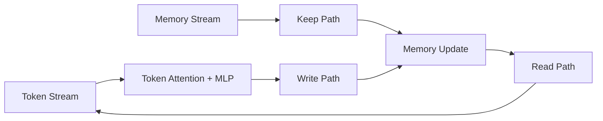
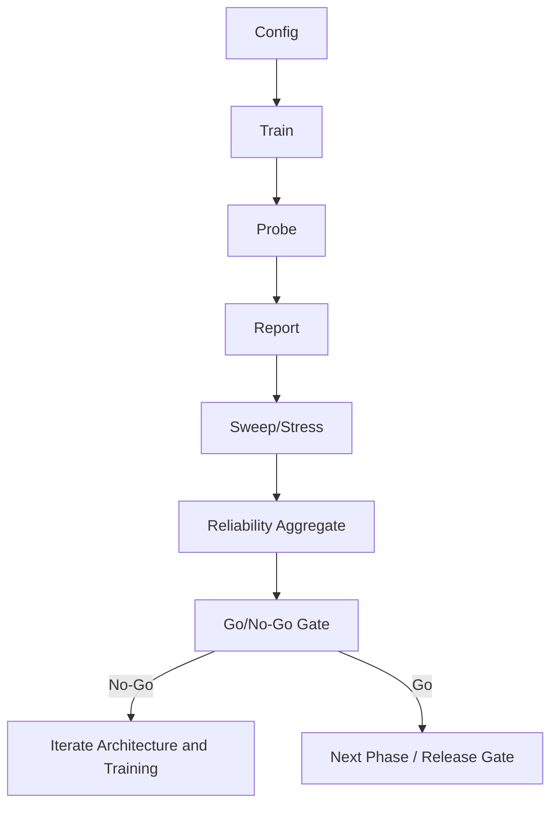

# Executive Overview

## Revision History
- 2026-03-04: Initial executive brief added with multi-seed reliability analysis and gate decision framing.

## Program History
1. Baseline corridor architecture established with explicit write/keep scheduling and probe instrumentation.
2. Frontier stress campaign (`corridor_stress_v5`) expanded operating envelope to 16 layers, 6 memories, and long distances.
3. Reliability campaign (`corridor_reliability_v1`) repeated the six frontier cases across 3 seeds (18 total trials).
4. Decision process shifted from single-run point outcomes to multi-seed pass-rate evidence.

## Current Status (As of 2026-03-04)
- Decision: **GO for next validation phase**, **NO-GO for production release**.
- Why:
  - Corridor stability is consistently strong, including failed retrieval-threshold cases.
  - Retrieval pass-rate is not yet production-grade at the hardest frontier configurations.

## Key Metrics
Source artifacts:
- `demo_runs/corridor_stress_v5/sweep_summary.json`
- `demo_runs/corridor_reliability_v1/report/reliability_summary.json`

| Metric | Value |
|---|---:|
| Frontier cases | 6 |
| Reliability seeds | 3 |
| Total reliability trials | 18 |
| Total passes | 7 |
| Overall pass rate | 38.9% |
| Best case pass rate | 66.7% |
| Worst case pass rate | 0.0% |
| Dominant failure mode | `min_eval_accuracy` threshold miss |
| Corridor stability signal | strong and consistent |

## Case-Level Reliability (3 Seeds)
| Case | Passes | Pass Rate |
|---|---:|---:|
| `stress_layers16_writes1_dist64_mem6_noise32_pairs96` | 2 / 3 | 66.7% |
| `stress_layers16_writes2_dist64_mem6_noise32_pairs96` | 1 / 3 | 33.3% |
| `stress_layers16_writes3_dist64_mem6_noise32_pairs96` | 0 / 3 | 0.0% |
| `stress_layers16_writes1_dist56_mem6_noise32_pairs96` | 2 / 3 | 66.7% |
| `stress_layers16_writes2_dist56_mem6_noise32_pairs96` | 2 / 3 | 66.7% |
| `stress_layers16_writes3_dist56_mem6_noise32_pairs96` | 0 / 3 | 0.0% |

## Decision Reasoning
1. Architectural hypothesis is validated:
   - keep layers preserve memory-channel stability under high difficulty.
   - failures do not show corridor collapse signatures.
2. Product readiness is not yet validated:
   - pass-rate variance is high across seeds.
   - hardest cases have insufficient reliability margin for production.
3. Executive implication:
   - continue investment in retrieval robustness optimization.
   - do not commit to production launch gate yet.

## Architecture Diagram

## Process Flow

## Visual Evidence Pack
- `demo_runs/corridor_reliability_v1/report/pass_rate_by_case.svg`
- `demo_runs/corridor_reliability_v1/report/mean_min_eval_accuracy_by_case.svg`
- `demo_runs/corridor_reliability_v1/report/success_rate_by_seed.svg`
- `demo_runs/corridor_stress_v5/corridor_scores.svg`
- `demo_runs/corridor_stress_v5/min_eval_accuracy.svg`

## Next Gate Criteria
Production gate should require all:
1. Overall pass rate >= 0.80 on frontier matrix.
2. No frontier case below 0.67 pass rate.
3. No instability pattern in keep-layer criteria.
