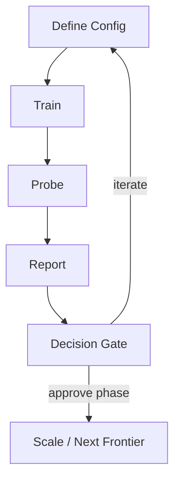

# Process Flow

## Revision History
- 2026-03-04: Initial process flow document added for train/probe/report/sweep/stress lifecycle.

## End-to-End Lifecycle

## Pipeline Stages
1. Train
- Inputs: model config + task config + optimization config.
- Outputs: params, optimizer state, history, eval accuracy.

2. Probe
- Inputs: saved run + probe config.
- Outputs: Jacobian/eigenspace/drift/leakage metrics and plots.

3. Report
- Inputs: train outputs + probe outputs + thresholds.
- Outputs: corridor score, pass/fail criteria, summary artifacts.

4. Sweep/Stress
- Inputs: configuration grids.
- Outputs: ranked case summary, hardest success, easiest failure.

## CLI Process Entry Points
- `train`: single run training.
- `probe`: diagnostics for a saved run.
- `report`: threshold scoring for a run+probe pair.
- `sweep`: grid search with ranking.
- `stress`: hardest-first search with optional early stop.

## Resume Behavior
- `sweep --resume` and `stress --resume`:
  - reuse existing `report/report.json` per case.
  - continue only missing cases.
  - write incremental summary artifacts during execution.

## Data Artifacts
- Run-level:
  - `train/` artifacts
  - `probe/` artifacts
  - `report/` artifacts
- Study-level:
  - `sweep_summary.json`
  - `sweep_summary.csv`
  - `sweep_summary.txt`
  - summary SVGs
